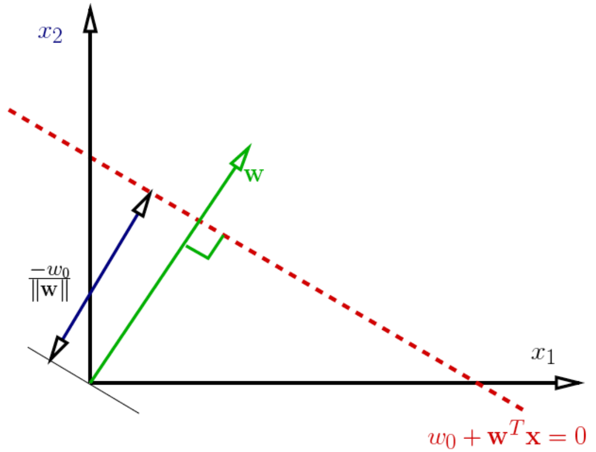
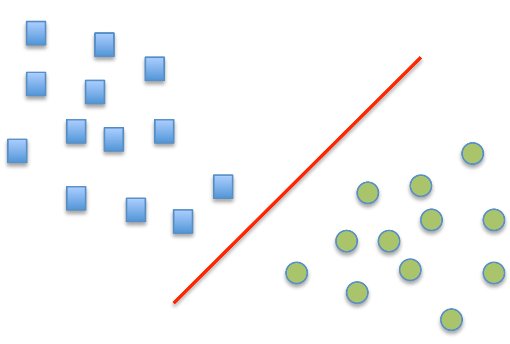
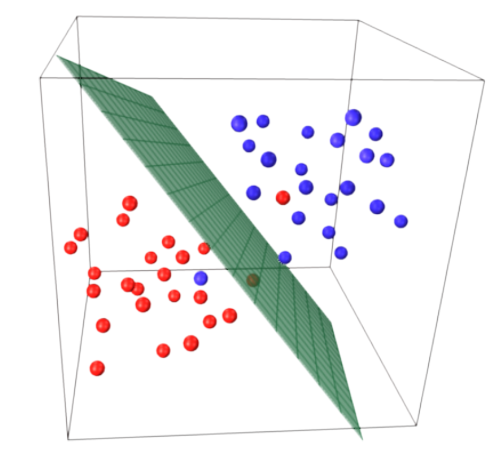
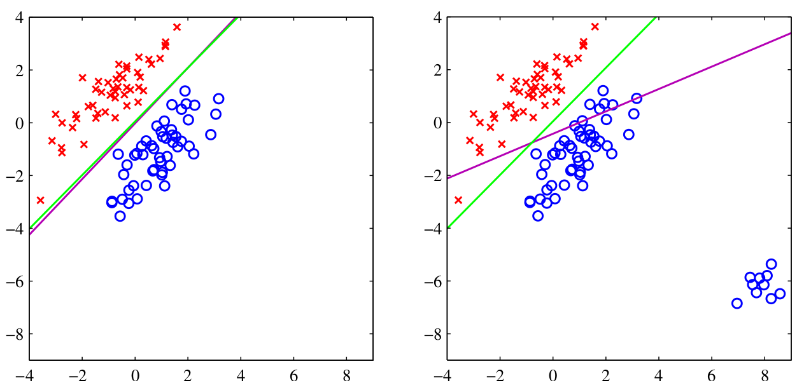

Classification des Moindres Carrés (Least- Squares Classification)
================

[Jupyter notebook](https://github.com/krimotafer/least_squares_classification/blob/main/Least_Squares_Classification.ipynb)  
[Kaggle](https://www.kaggle.com/code/abdelkrimtafer/least-squares-classification)


# 1 Introduction

La classification consiste à déterminer à quelle catégorie appartient
une observation parmi un ensemble de catégories prédéfinies. Ce
processus est fondamental dans divers domaines, allant de
l’identification du spam dans les e-mails à l’attribution d’un
diagnostic à un patient en fonction de ses caractéristiques observées,
telles que le sexe, la pression artérielle ou la présence de certains
symptômes. Ces observations sont analysées en fonction de
caractéristiques quantifiables, pouvant être catégoriques, ordinales, à
valeurs entières ou réelles.

Dans l’apprentissage supervisé, les algorithmes de classification
utilisent des données étiquetées pour entraîner un modèle. Chaque
exemple du jeu de données d’entraînement est associé à une étiquette de
classe connue, permettant au modèle d’apprendre à prédire correctement
les classes pour de nouvelles observations.

Il existe une multitude d’algorithmes de classification, chacun
présentant des caractéristiques distinctes :

- **Classification des moindres carrés (Least-Squares Classification)
  :** Utilise la méthode des moindres carrés pour modéliser les
  relations linéaires entre les caractéristiques et les étiquettes de
  classe.

- **Régression Logistique :** Utilise une fonction logistique pour
  estimer les probabilités des classes.

- **Arbres de Décision :** Représentent une structure arborescente où
  chaque nœud représente une caractéristique et les branches déterminent
  les règles de décision.

- **Machines à Vecteurs de Support (SVM) :** Trouvent un hyperplan
  optimal pour séparer les classes tout en maximisant la marge entre
  elles.

- **K plus proches voisins (KNN) :** Classent les observations en
  fonction des classes majoritaires parmi les $k$ voisins les plus
  proches dans l’espace des caractéristiques.

- **Réseaux de Neurones :** Modèles complexes apprenant des
  représentations hiérarchiques des données pour la classification.

Ces algorithmes diffèrent par leurs approches de modélisation et leurs
capacités à traiter des structures de données variées. Ils sont
sélectionnés en fonction de la nature des données, de la complexité du
problème et des performances attendues.

Nous allons nous intéresser plus particulièrement à la méthode de
classification des moindres carrés (ou Least-Squares Classification en
anglais).

# 2 Classification des Moindres Carrés (Least-Squares Classification)

Dans la classification des moindres carrés, on s’intéresse à
l’utilisation de méthodes de régression pour résoudre des problèmes de
classification catégorique.

Prenons le cas d’une classification binaire, où les étiquettes de classe
sont -1 ou 1. En utilisant une approche de régression linéaire, on peut
former un modèle pour minimiser la somme des carrés des différences
entre les prédictions et les étiquettes réelles. Ce modèle peut être
représenté comme $y(x) = w^T x$, où $w$ est un vecteur de poids.

La frontière de décision dans la classification des moindres carrés est
définie par $w^T x = 0$.



Pour des données en deux dimensions, cette équation représente une ligne
droite. En général, dans des espaces de dimensions supérieures, cela
forme un hyperplan qui sépare les classes.

<div class="figure">


<p class="caption">
Classification 2D et 3D.
</p>

</div>

## 2.1 Régression Linéaire

La régression linéaire est utilisée pour estimer une variable cible $y$
à partir de variables prédictives $x$ à l’aide d’un modèle linéaire.

### 2.1.1 Modèle de Régression Linéaire

Soit $\mathbf{X}$ une matrice de dimensions $N \times D$ représentant
nos caractéristiques pour $N$ exemples et $D$ caractéristiques. La
relation entre $\mathbf{X}$ et $\mathbf{y}$ est modélisée par
$\mathbf{y} = \mathbf{X} \mathbf{w} + \mathbf{b}$, où :  
- $\mathbf{w}$ est un vecteur de poids de longueur $D$.  
- $\mathbf{b}$ est le biais.

### 2.1.2 Fonction de Perte en Régression Linéaire

La fonction de perte pour la régression linéaire est la somme des
moindres carrés (ou somme des erreurs quadratiques) :

```math
L(\mathbf{w}, \mathbf{b}) = \frac{1}{2N} \left \| \mathbf{y} - \mathbf{X}\mathbf{w} - \mathbf{b} \right \|^2
```

## 2.2 Adaptation à la Classification par les Moindres Carrés

Dans la classification, on utilise la régression linéaire pour estimer
les étiquettes de classe dans un contexte binaire.

- Étiquettes de Classe : $\mathbf{t}$ (valeurs de -1 ou 1 pour une
  classification binaire).
- La fonction de perte devient :

```math
L(\mathbf{w}, \mathbf{b}) = \frac{1}{2N} \left \| \mathbf{t} - \mathbf{X}\mathbf{w} - \mathbf{b} \right \|^2
```

### 2.2.1 Composante Biais et Matrice Augmentée

Pour incorporer le biais, on ajoute une colonne de uns à gauche de
$\mathbf{X}$, créant une matrice augmentée $\tilde{\mathbf{X}}$ de
dimensions $N \times (D+1)$. 

```math
 \tilde{\mathbf{X}} = \begin{bmatrix}
1 & x_{1}^T \\
1 & x_{2}^T \\
\vdots & \vdots \\
1 & x_{N}^T \\
\end{bmatrix}
```

### 2.2.3 Calcul des Poids Optimaux

En minimisant la fonction de perte par rapport à $\mathbf{w}$ et
$\mathbf{b}$, on dérive une solution analytique pour les poids optimaux
$\tilde{\mathbf{w}}$ :

```math
\tilde{\mathbf{w}} = (\tilde{\mathbf{X}}^T \tilde{\mathbf{X}})^{-1} \tilde{\mathbf{X}}^T \mathbf{t}
```

Cette solution est obtenue à l’aide de la pseudo-inverse pour résoudre
le système linéaire et fournit les poids optimaux pour la classification
des moindres carrés dans un contexte binaire.

## 2.3 Classification des Moindres Carrés pour plusieurs classes

En utilisant la méthode des moindres carrés pour la classification, on
peut l’adapter pour gérer des problèmes multi-classes.

### 2.3.1 Modèle pour plusieurs classes

Pour chaque classe $C_k$, un modèle linéaire distinct est utilisé :
```math
 y_k(\mathbf{x}) = \mathbf{w}_k^T \mathbf{x} + w_{k0}
```
- $k = 1, \dots, K$ représente les différentes classes.
- $\mathbf{w}_k$ est un vecteur de poids pour la classe $k$ avec une
  dimension égale à celle des caractéristiques plus le biais.
- $w_{k0}$ est le terme de biais pour la classe $k$.

### 2.3.2 Vecteur de sortie pour toutes les classes

Regroupons ces modèles en utilisant une notation vectorielle :
```math
 \mathbf{y}(\mathbf{x}) = \mathbf{W}^T \mathbf{x}
```

- $\mathbf{W}$ est une matrice de taille $(D+1) \times K$ où chaque
  colonne représente les poids pour une classe spécifique.
- $\mathbf{x}$ est le vecteur d’entrée augmenté avec une composante pour
  le biais.

### 2.3.3 Fonction de Perte

En utilisant un ensemble de données d’entraînement
$\{ \mathbf{x}_n, \mathbf{t}_n \}$ où $n = 1, \dots, N$ et
$\mathbf{t}_n$ est le vecteur cible pour la $n$-ème observation, la
fonction de perte peut être définie comme suit :

```math
L(\mathbf{W}) = \frac{1}{2N} \| \mathbf{T} - \mathbf{X}\mathbf{W} \|^2
```

- $\mathbf{T}$ est une matrice de dimensions $N \times K$ contenant les
  vecteurs cibles pour chaque exemple d’entraînement.
- $\mathbf{X}$ est une matrice augmentée de taille $N \times (D+1)$
  représentant les caractéristiques d’entrée augmentées pour chaque
  exemple.

### 2.3.4 Calcul des Poids Optimaux

Pour obtenir les poids optimaux $\mathbf{W}$, on minimise la fonction de
perte par rapport à $\mathbf{W}$. La solution est donnée par :

```math
\mathbf{W} = (\mathbf{X}^T \mathbf{X})^{-1} \mathbf{X}^T \mathbf{T}
```

## 2.4 Seuil de Décision

### 2.4.1 Classification Binaire

Pour convertir les prédictions continues en une prédiction binaire, un
seuil de décision est choisi. Si la prédiction $\hat{y}(\mathbf{x})$
dépasse ce seuil, on classe l’observation dans la catégorie positive
($1$) ; sinon, elle est classée dans la catégorie négative ($0$). Cela
peut être exprimé comme : 

```math
\hat{t}(x) = \begin{cases} 1 & \text{si } \hat{y}(x) > seuil \\ 
0 & \text{sinon} \end{cases}
```

### 2.4.2 Classification multi-classe :

Pour la classification multi-classe, chaque classe possède son propre
modèle. La décision est prise en comparant les prédictions de chaque
modèle pour attribuer une observation $\mathbf{x}$ à une classe
spécifique.

**Comparaison des Prédictions :** Les prédictions pour chaque classe
sont calculées à l’aide des modèles correspondants. La classe prédite
pour l’observation $\mathbf{x}$ est celle ayant la prédiction la plus
élevée. Cela peut être formulé comme :

```math
\hat{t}(x) = \underset{k}{\arg \max} \;  \hat{y}_{k}(x)
```

où $\hat{y}_k(x)$ représente la prédiction pour la classe $k$.

## 2.5 Classification Non Binaire

À partir de la section 2.3, on comprend que la méthode de classification
des moindres carrés peut être étendue pour traiter des problèmes de
classification impliquant plus de deux classes. Pour ce faire, diverses
stratégies peuvent être adoptées. Par exemple, les approches One-vs-Rest
(OvR) ou One-vs-One (OvO) peuvent être utilisées pour élargir la portée
de la classification des moindres carrés.

- **OvR (One-vs-Rest)** : $K$ modèles sont entraînés, un pour chaque
  classe par rapport à toutes les autres classes.
- **OvO (One-vs-One)** : $\frac{K(K-1)}{2}$ modèles binaires sont
  entraînés pour chaque paire de classes.

## 2.6 Fonction de perte

On peut appliquer différente fonctions de perte dans des contextes
différents selon la manière dont on veut évaluer et pénaliser les
erreurs du modèle. Ces fonctions de perte sont utilisées pour mesurer la
performance des classificateurs en évaluant la différence entre les
prédictions du modèle $(y(x))$ et les vraies étiquettes ($t$).

1.  **Perte de zéro/une :** Cette fonction évalue la perte en fonction
    de la prédiction par rapport à la vraie étiquette. Elle attribue une
    perte de 0 lorsque la prédiction est correcte $(y(x) = t)$ et une
    perte de $1$ lorsqu’il y a une prédiction incorrecte
    $(y(x) \neq t)$.
```math
    L_{0-1}(y(x), t) = \begin{cases} 0 & \text{si } y(x) = t \\ 1 & \text{si } y(x) \neq t \end{cases}
```

1.  **Perte binaire asymétrique :** Cette perte est utilisée lorsqu’il y
    a un déséquilibre entre les classes. Elle attribue des poids
    différents aux erreurs en fonction de la prédiction et de la vraie
    étiquette. Si $y(x) = 1$ et $t = 0$, la perte est $\alpha$. Si
    $y(x) = 0$ et $t = 1$, la perte est $\beta$. Pour une prédiction
    correcte $(y(x) = t)$, la perte est nulle.
```math
    L_{ABL}(y(x), t) = \begin{cases} \alpha & \text{si } y(x) = 1 \land t = 0 \\ \beta & \text{si } y(x) = 0 \land t = 1 \\ 0 & \text{si } y(x) = t \end{cases}
```

2.  **Perte quadratique :** Cette fonction mesure la perte en prenant le
    carré de la différence entre la prédiction et la vraie étiquette.
    Elle est souvent utilisée dans la régression et attribue une
    pénalité plus importante aux erreurs importantes.

    $$L_{\text{squared}}(y(x), t) = (t - y(x))^2$$

3.  **Erreur absolue :** Cette perte mesure simplement la différence
    absolue entre la prédiction et la vraie étiquette, ignorant la
    direction de l’erreur.

    $$L_{\text{absolute}}(y(x), t) = |t - y(x)|$$

## 2.7 Évaluation du modèle

### 2.7.1 Matrice de Confusion

La matrice de confusion est une matrice $2 \times 2$ (pour une
classification binaire) ou $K \times K$ (pour une classification
multi-classe) où $K$ est le nombre de classes. Pour une classification
binaire, elle est représentée comme suit :

```math
\text{Matrice de Confusion} = \begin{bmatrix}
VP & FP \\
FN & VN \\
\end{bmatrix}
```

### 2.7.2 Précision et Rappel

La précision en classification mesure l’exactitude des prédictions
positives du modèle par rapport à l’ensemble des prédictions positives,
tandis que le rappel évalue la capacité du modèle à identifier
correctement tous les éléments positifs par rapport à l’ensemble des
éléments positifs réels.

La précision et le rappel sont calculés comme suit :

```math
\text{Précision} = \frac{VP}{VP + FP} = \frac{VP}{\text{toutes les prédiction}}
```
```math
\text{Rappel} = \frac{VP}{VP + FN}
```


où :  
- VP : Vrais Positifs  
- FP : Faux Positifs  
- FN : Faux Négatifs

Le F1 score est une mesure combinée de la précision et du rappel,
représentée par la formule
$$F1 = \frac{2 \times \text{Précision} \times \text{Rappel}}{\text{Précision} + \text{Rappel}}$$.
Cette mesure harmonique donne un équilibre entre la précision et le
rappel en calculant la moyenne pondérée des deux. Un F1 score élevé
indique à la fois une précision élevée et un rappel élevé, ce qui est
bénéfique pour évaluer les performances globales d’un modèle de
classification.

### 2.7.3 Courbe ROC

La courbe ROC est tracée en utilisant le Taux de Vrais Positifs (TPR) et
le Taux de Faux Positifs (FPR) : 
```math
\text{TPR} = \frac{VP}{VP + FN}
```

```math
\text{FPR} = \frac{FP}{FP + VN}
```

### 2.7.4 Cross-Validation

La validation croisée est une technique pour évaluer la performance d’un
modèle en utilisant des sous-ensembles différents des données
disponibles. Cela permet d’estimer la capacité du modèle à généraliser
de nouvelles données.

## 2.8 Limitations

La linéarité de la méthode des moindres carrés limite sa capacité à
capturer des relations non linéaires entre les caractéristiques et les
étiquettes de classe, ce qui peut être problématique pour des modèles
plus complexes.

La méthode des moindres carrés manque aussi de robustesse face aux
données aberrantes en plus du fait qu’elle peut être inappropriée pour
des distributions non gaussiennes. D’autres méthodes, comme la
régression logistique, offrent des solutions plus adaptées à ces
problèmes.

<div class="figure" style="text-align: center">


<p class="caption">
En comparaison avec la classification par régression logistique (couleur
vert), il est observable que la régression par la méthode des moindres
carrés (couleur magenta) est plus sensible aux valeurs aberrantes. Les
moindres carrés peuvent être davantage influencés par les valeurs
extrêmes ou atypiques présentes dans les données d’apprentissage.
</p>

</div>

# Références

- **Pattern Recognition And Machine Learning**, Christopher M.
  BishopChristopher M. Bishop
- **CSC 411: Lecture 03: Linear Classification**, Richard Zemel, Raquel
  Urtasun and Sanja Fidler, University of Toronto
- **CSC 411: Lecture 07: Multiclass Classification**, Richard Zemel,
  Raquel Urtasun and Sanja Fidler, University of Toronto
- **Derivation of Least Squares Regressor and Classifier**, Diego
  Unzueta
- [**notesonai**](https://notesonai.com/least+squares+for+classification)
